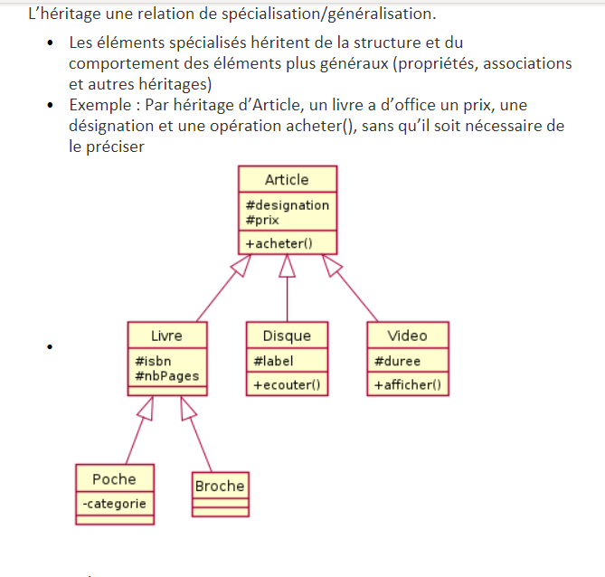

# Examen 1

Note de cours examen 1 programmation 3

## Table des matière
- [Examen 1](#examen-1)
  * [Question 1](#question-1)
    + [La pile (Stack)](#la-pile--stack-)
      - [Cas d'utilisation](#cas-d-utilisation)
    + [La file (Queue)](#la-file--queue-)
    + [La list (List)](#la-list--list-)
    + [La list doublement chainé (Linked List)](#la-list-doublement-chain---linked-list-)
      - [Cas d'utilisation](#cas-d-utilisation-1)
    + [L'arbre binaire (Tree)](#l-arbre-binaire--tree-)
      - [Cas d'utilisation](#cas-d-utilisation-2)
  * [Question 2](#question-2)
    + [Exemple de structure de données](#exemple-de-structure-de-donn-es)
  * [Question 3](#question-3)
    + [PILE](#pile)
    + [FILE](#file)
    + [LIST Doublement chainer](#list-doublement-chainer)
    + [HEAP](#heap)

<small><i><a href='http://ecotrust-canada.github.io/markdown-toc/'>Table of contents generated with markdown-toc</a></i></small>

## Question 1

Les structures de données

### La pile (Stack)
<pre>
    Dernier entré premier sorti
</pre>

#### Cas d'utilisation
- Inverser une série de données 
- Implémenter le "Undo" 
- Trouver un chemin dans un labyrinthe 
- Traiter les appels de fonctions imbriquées 
- Calculer une expression mathématique en tenant compte des priorités des opérateurs 

### La file (Queue)
<pre>
    Premier entré premier sorti
</pre>

### La list (List)
<pre>
    Contient le prochain
</pre>

### La list doublement chainé (Linked List)
<pre>
    Contient le prochain et le précédent
</pre>

#### Cas d'utilisation
- Implémenter les structures pile et file 
- Implémenter un graphe 
- Caroussel d'images, de chansons, etc... (chaînage double) 
- Allouer du temps de processeur aux applications en cours 

### L'arbre binaire (Tree)
<pre>
    OU TAS (partiellement triée)
</pre>

#### Cas d'utilisation
- Manipuler des données hiérarchiques  
- Faciliter la recherche d'informations (ex : dictionnaire) 
- Composition d'effets sur des images 
- Algorithme de routage 
- Prise de décision en plusieurs étapes  

## Question 2
### Exemple de structure de données


## Question 3
Exemple d'implémentation des structures de données

### PILE

Node.h
```cpp
class Node
{
private:
	int m_data; // élément contenant les données
	Node* m_next; // lien vers la prochaine donnée de la série
public:
	Node(int data);
	int getData();
	void setData(int data);
	Node* getNext();
	void setNext(Node* next);
};
```

Node.cpp
```cpp
#include "Node.h"

Node::Node(int data) : m_data{ data }, m_next{ nullptr }{}

int Node::getData() 
{
	return m_data;
}

void Node::setData(int data)
{
	m_data = data;
}

Node* Node::getNext()
{
	return m_next;
}

void Node::setNext(Node* next)
{
	m_next = next;
}
```

NodeStack.h

```cpp
#include "Node.h"

class NodeStack
{
private:
	int m_size; // compteur pour le nombre d'éléments de la pile
	Node* m_top; // pointeur vers l'élément du dessus de la pile
public:
	NodeStack();
	~NodeStack();
	int getSize(); // retroune le nombre d'éléments dans la pile
	bool isEmpty(); // vrai si la pile est vide
	void push(int data); // ajoute une donnée à la pile
	void pop(); // enlève le premier élément sur le dessus de la pile
	int getTop(); // retourne la donnée sur le dessus de la pile, sans modifier la pile
	void affichePile(); // fonction utilitaire pour afficher l'état de la pile
};
```

NodeStack.cpp

```cpp
#include "NodeStack.h"
#include "Node.h"
#include <iostream>

NodeStack::NodeStack() : m_size{ 0 }, m_top{ nullptr }{}

NodeStack::~NodeStack()
{
	Node* temp{ m_top };
	while (!(temp == nullptr))
	{
		m_top = m_top->getNext();
		temp->setNext(nullptr);
		delete temp;
		temp = m_top;
	}
}

int NodeStack::getSize()
{
	return m_size;
}

bool NodeStack::isEmpty()
{
	return m_top == nullptr;
}

void NodeStack::push(int data)
{
	Node* temp{ new Node{data} };
	temp->setNext(m_top);
	m_top = temp;

	m_size++;
}

void NodeStack::pop()
{
	if (isEmpty())
	{

		std::cout << "Pile vide\n";
		return;
	}

	Node* temp{ m_top };
	m_top = m_top->getNext();
	temp->setNext(nullptr);
	delete temp;
	
	m_size--;
}

int NodeStack::getTop()
{
	if (isEmpty())
	{
		std::cout << "Pile vide\n";
		return -1;
	}

	return m_top->getData();
}

void NodeStack::affichePile()
{
	if (isEmpty())
	{
		std::cout << "Pile vide\n";
		return;
	}

	Node* temp{ m_top };
	std::cout << "TOP -> ";
	while (!(temp == nullptr))
	{
		std::cout << temp->getData() << " ";
		temp = temp->getNext();
	}

	std::cout << "\n";
}
```

### FILE

Node.h
```cpp
class Node
{
private:
	int m_data;
	Node* m_next;
public:
	Node(int data);
	int getData();
	Node* getNext();
	void setNext(Node* next);
};

```

Node.cpp
```cpp
#include "Node.h"

Node::Node(int data) : m_data{ data }, m_next{ nullptr }{}

int Node::getData()
{
	return m_data;
}

Node* Node::getNext()
{
	return m_next;
}

void Node::setNext(Node* next)
{
	m_next = next;
}
```

NodeQueue.h
```cpp
#include "Node.h"

class NodeQueue
{
private:
	Node* m_front;
	Node* m_back;
	int m_size;
public:
	NodeQueue();
	int getFront();
	int getBack();
	void enqueue(int data);
	void dequeue();
	bool isEmpty();
	void afficherFile();
};
```

NodeQueue.cpp
```cpp
#include "Node.h"
#include "NodeQueue.h"
#include <iostream>

NodeQueue::NodeQueue() : m_front{ nullptr }, m_back{ nullptr }, m_size{ 0 }{}

bool NodeQueue::isEmpty()
{
	if (m_front == nullptr)
	{
		return true;
	}

	return false;
}

int NodeQueue::getFront()
{
	if (isEmpty())
	{
		std::cout << "\nFile vide!";
		return -1;
	}

	return m_front->getData();
}

int NodeQueue::getBack()
{
	if (isEmpty())
	{
		std::cout << "\nFile vide!";
		return -1;
	}

	return m_back->getData();
}

void NodeQueue::enqueue(int data)
{
	Node* temp{ new Node{data} };

	// Si c'est la première insertion
	// faire pointer l'avant ET l'arrière sur le nouveau noeud
	if (isEmpty())
	{
		m_front = temp;
		m_back = temp;
	}

	m_back->setNext(temp);
	m_back = temp;
}

void NodeQueue::dequeue()
{
	if (isEmpty())
	{
		std::cout << "\nFile vide!";
		return;
	}

	Node* temp = m_front;
	m_front = m_front->getNext();

	// Si on est au dernier élément de la chaîne
	// m_front devient nullptr et il faut mettre m_back à nullptr aussi
	// sinon m_back va continuer de pointer vers l'élément que l'on va libérer de la mémoire
	if (m_front == nullptr)
	{
		m_back = nullptr;
	}

	temp->setNext(nullptr);
	delete temp;
}

void NodeQueue::afficherFile()
{
	std::cout << "FRONT ";
	Node* temp = m_front;
	while (temp != nullptr)
	{
		std::cout << temp->getData() << "->";
		temp = temp->getNext();
	}
	std::cout << " BACK\n";
}
```

### LIST Doublement chainer

node.h
```cpp
#pragma once
class Node
{
public:
	Node(int data);
	~Node();
	Node* m_next;
	Node* m_prev;
	int m_data;
};

```

node.cpp
```cpp
#include "Node.h"

Node::Node(int data)
{
	this->m_next = nullptr;
	this->m_prev = nullptr;
	this->m_data = data;
}

Node::~Node()
{
}    
```

nodeList.h
```cpp
#pragma once
#include "Node.h"
class NodeList
{
public:
	NodeList();
	~NodeList();
	void addNode(Node* node);
	void removeNode(Node* node);
	Node* getNode(int index);
	int getSize();
	void clear();
private:
	Node* head;
	Node* tail;
};


```

nodeList.cpp
```cpp

#include "NodeList.h"

NodeList::NodeList()
{
	head = nullptr;
	tail = nullptr;
}

NodeList::~NodeList()
{
}

void NodeList::addNode(Node* node)
{
	if (node == nullptr)
	{
		return;
	}

	if (head == nullptr)
	{
		head = node;
		tail = node;
	}
	else
	{
		tail->m_next = node;
		tail = node;
	}
}

void NodeList::removeNode(Node* node)
{
	if (node == nullptr)
	{
		return;
	}

	if (head == node)
	{
		head = head->m_next;
	}
	else
	{
		Node* temp = head;
		while (temp->m_next != node)
		{
			temp = temp->m_next;
		}
		temp->m_next = node->m_next;
	}

}

Node* NodeList::getNode(int index)
{
	if (index < 0)
	{
		return nullptr;
	}

	Node* temp = head;
	for (int i = 0; i < index; i++)
	{
		temp = temp->m_next;
	}

	return temp;

}

int NodeList::getSize()
{
	int size = 0;
	Node* temp = head;
	while (temp != nullptr)
	{
		size++;
		temp = temp->m_next;
	}
	return size;
}

void NodeList::clear()
{
	head = nullptr;
	tail = nullptr;
}

```

### HEAP

heap.h
```cpp

#pragma once
class Heap
{
public:
	
	Heap(int* arrayData, int size);	
	
	/**
	* Transform array to heap
	*/
	void heapify();

	/**
	* Get parent index from index	
	*/
	int getParent(int index);

	/**
	* 	Get left child index from index
	*/
	int getLeftChild(int index);
	
	/**
	* 	Get right child index from index
	*/
	int getRightChild(int index);

	/**
	* Print the array in console	
	*/
	void printArray();
	
	/**
	* Insert in heap	
	*/
	void insertHeap(int data);
	
	/**
	* 	Pop heap head
	*/ 	
	int popHeap();

	/**
	* Validate that array is a heap
	*/
	bool isHeap();

	/**
	* Pop the min value
	*/
	int popMin();

	/**
	* Print the heap sorted
	*/
	void printSortHeap();

	/**
	* Get the index of min
	*/
	int getIndexMin();

	/**
	* Search a value and popit
	*/
	void popValue(int searchValue);
	
private:
	
	int* m_data;
	
	int m_size;
};


```

heap.cpp
```cpp
#include "Heap.h"
#include <iostream>

Heap::Heap(int* arrayData, int size) {
	//Set array size
	m_size = size;
	m_data = arrayData;
}

void Heap::heapify()
{
	int i = 0;
	int l = 0;
	int r = 0;
	int largest = 0;
	int temp = 0;
	int size = m_size;
	
	for (i = size / 2; i >= 0; i--)
	{
		l = 2 * i + 1;
		r = 2 * i + 2;
		largest = i;
		if (l < size && m_data[l] > m_data[largest])
		{
			largest = l;
		}
		if (r < size && m_data[r] > m_data[largest])
		{
			largest = r;
		}
		if (largest != i)
		{
			temp = m_data[i];
			m_data[i] = m_data[largest];
			m_data[largest] = temp;
			heapify();
		}
	}
}

int Heap::getParent(int index)
{
	return (index - 1) / 2;
}

int Heap::getLeftChild(int index)
{
	//get left child index in array heap
	return 2 * index + 1;
}

int Heap::getRightChild(int index)
{
	//get right child index in array heap
	return 2 * index + 2;
}

void Heap::printArray()
{
	//print array in console
	for (int i = 0; i < m_size; i++)
	{
		std::cout << m_data[i] << " ";
	}
	std::cout << std::endl;
}

void Heap::insertHeap(int data)
{
	//insert new data in heap
	m_size++;
	m_data[m_size - 1] = data;
	int i = m_size - 1;
	while (i > 0 && m_data[getParent(i)] < m_data[i])
	{
		int temp = m_data[i];
		m_data[i] = m_data[getParent(i)];
		m_data[getParent(i)] = temp;
		i = getParent(i);
	}
}

int Heap::popHeap()
{
	int heapVal = m_data[0];

	for (int i = 0; i < m_size - 1; i++)
	{
		m_data[i] = m_data[i + 1];
	}
	m_size--;

	heapify();

	return heapVal;
}

int Heap::popMin()
{
	int indexMin = getIndexMin();
	int minValue{ m_data[indexMin] };

	m_data[indexMin] = m_data[m_size - 1];

	heapify();

	return minValue;
}

void Heap::printSortHeap()
{
	for (int i = 0; i < m_size; i++)
	{
		std::cout << popHeap() << " ";
	}
}

int Heap::getIndexMin()
{
	int indexMin = -1;


	for (int i = m_size / 2; i < m_size; i++)
	{
		if (indexMin == -1)
		{
			indexMin = i;
		}
		if (m_data[i] < m_data[indexMin])
		{
			indexMin = i;
		}
	}

	return indexMin;
}


void Heap::popValue(int searchValue)
{
	for (int i = 0; i < m_size; i++)
	{
		if (m_data[i] == searchValue)
		{
			m_data[i] = m_data[m_size - 1];
			m_size--;
			heapify();

			return;
		}
	}
}

bool Heap::isHeap()
{
	//check if the array is heap
	for (int i = 0; i < m_size; i++)
	{
		if (m_data[getParent(i)] < m_data[i])
		{
			return false;
		}
	}
	return true;
}


```